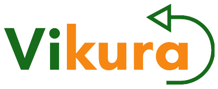
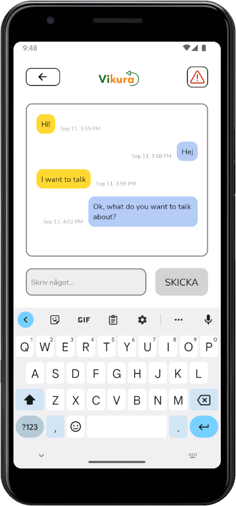
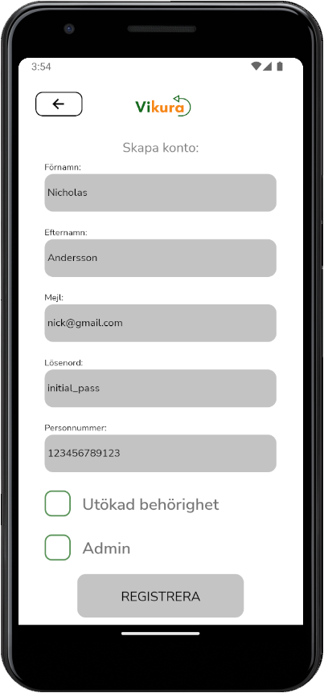

## Table of Contents
* [General Info](#general-information)
* [Technologies Used](#technologies-used)
* [Features](#features)
* [Screenshots](#screenshots)
* [Setup](#setup)
* [Usage](#usage)
* [Project Status](#project-status)
* [Room for Improvement](#room-for-improvement)
* [Contact and links](#contact-and-links)

## Description

Chat app designed to facilitate conversations between clients and School Welfare Officers/School Counselors. An essential tool for professionals working in student welfare at Vikura, creating new possibilities to overcome limitations of time and location.

## Technologies Used
**Framework:** React Native

**Database:** Cloud Firestore

**Authentication:** Firebase Authentication

**Testing Library:** Jest 

## Project Features
### Features

- Direct messaging between client and school counselor
- In-app account creation
- Abillity to report a concern (child protection referral)

### Examples

<table width="100%" style="border:0px solid white; width:100%;">
  <tr style="border: 0px;">
    <td width="50%" style="border:0px; width:50%"></td>
    <td width="50%" style="border:0px; width:50%"></td>
  </tr>
</table>

## Setup
What are the project requirements/dependencies? Where are they listed? A requirements.txt or a Pipfile.lock file perhaps? Where is it located?

Proceed to describe how to install / setup one's local environment / get started with the project.

## Usage
How does one go about using it?
Provide various use cases and code examples here.

`write-your-code-here`

## Project Status
Project is: _in progress_ 

## Room for Improvement
Include areas you believe need improvement / could be improved. Also add TODOs for future development.

Room for improvement:
- Improvement to be done 1
- Improvement to be done 2

To do:
- Feature to be added 1
- Feature to be added 2

## Contact and links
Created by [@BenyoMano](https://github.com/BenyoMano) - feel free to contact me!

[Vikura Website](https://vikura.se)