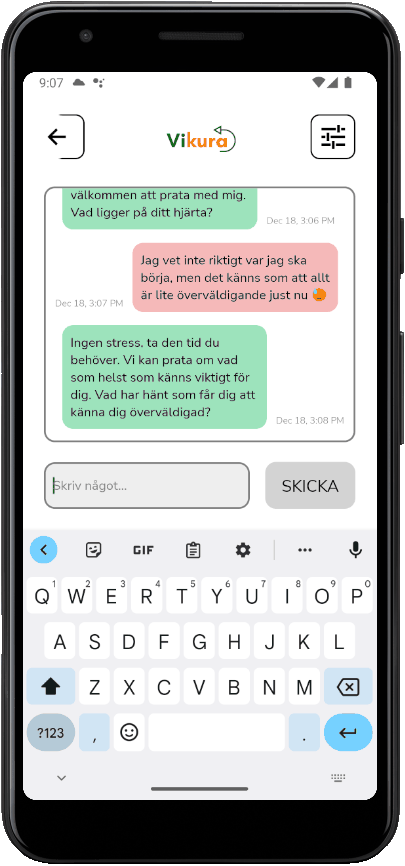
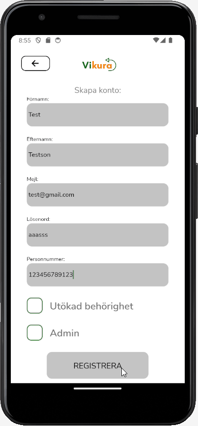

## Table of Contents

- [Description](#description)
- [Project Features](#project-features)
- [Installation and Setup](#installation-and-setup)
- [Technologies Used](#technologies-used)
- [Contact and links](#contact-and-links)

## Description

Chat app designed to facilitate conversations between clients and School Welfare Officers/School Counselors. An essential tool for professionals working in student welfare at Vikura, creating new possibilities to overcome limitations of time and location.

## Project Features

### Features:

- Direct messaging between client and school counselor
- In-app account creation
- Abillity to report a concern (child protection referral)

### Examples:

<table>
  <tr>
    <td></td>
    <td></td>
  </tr>
</table>

## Installation and Setup

Make sure you have the following software installed:

- [Node.js](https://nodejs.org/)
- [Git](https://git-scm.com/)

Clone the repository:

```bash
git clone https://github.com/BenyoMano/Vikura.git
```

Enter the project directory:

```bash
cd vikura
```

Install dependencies:

```bash
npm install
```

#### Start the app:

_For Windows and Android:_

```bash
npx react-native run-android
```

_For Mac and iOS:_

```bash
npx react-native run-ios
```

## Technologies Used

**Framework:** React Native

**Database:** Cloud Firestore

**Authentication:** Firebase Authentication

**Testing Library:** Jest

## Contact and links

Created by [@BenyoMano](https://github.com/BenyoMano) - feel free to contact me!

[](https://www.linkedin.com/in/benjamin-berg-b82b6717a/)

[Vikura Website](https://vikura.se)
